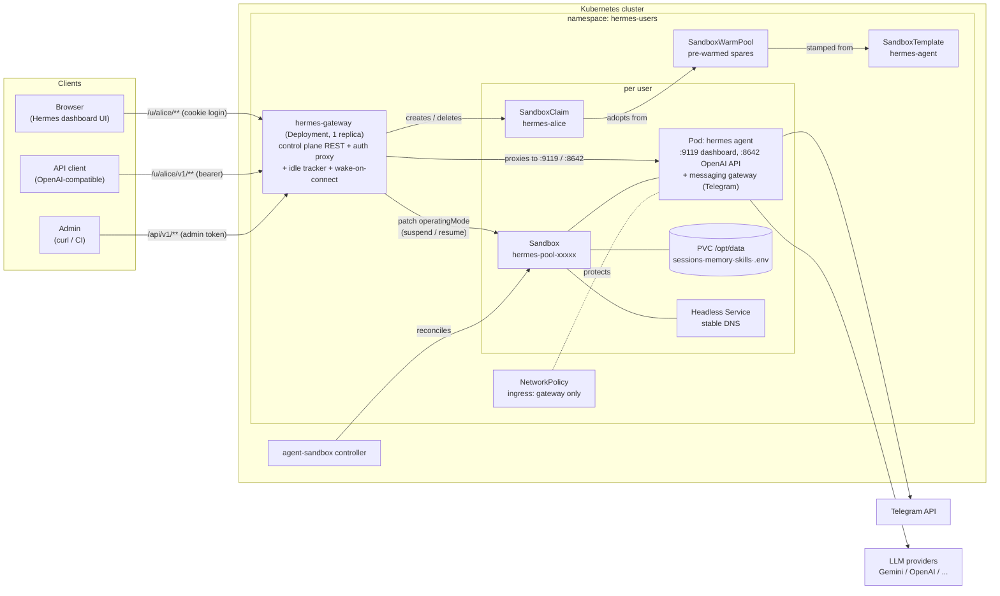
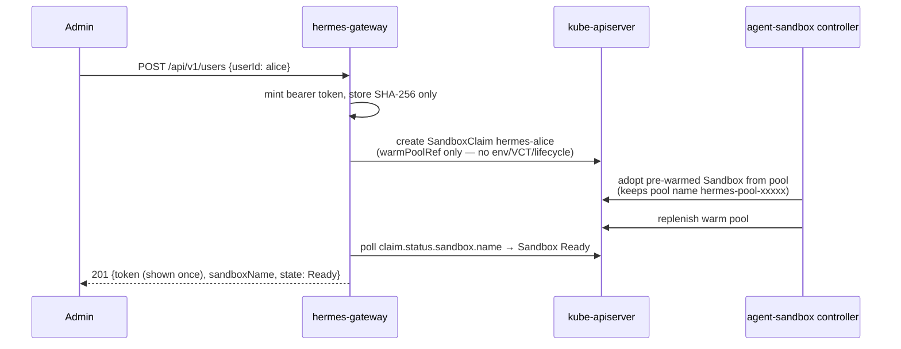
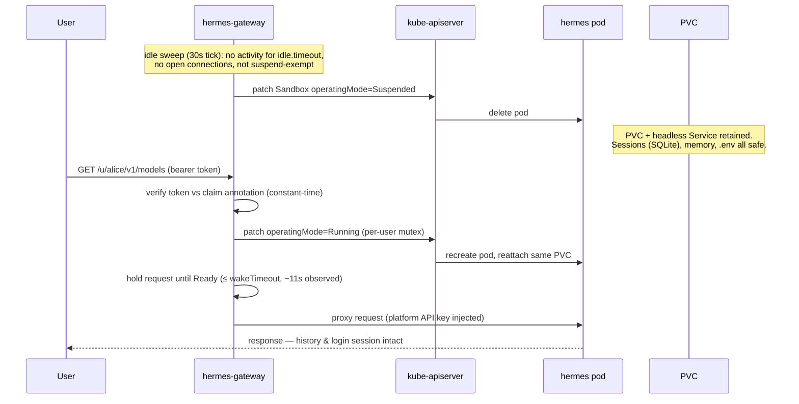
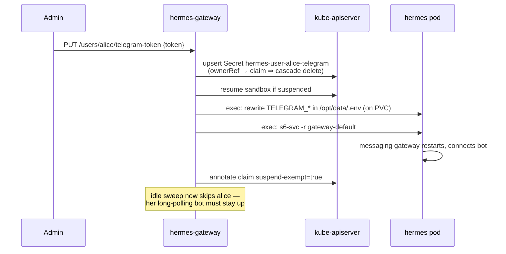

# ai-agent-service

Multi-user **AI agent as a service** on Kubernetes: every user gets a personal
[Hermes Agent](https://github.com/NousResearch/hermes-agent) running in its own
[agent-sandbox](https://github.com/kubernetes-sigs/agent-sandbox) `Sandbox`,
provisioned in ~2 seconds from a warm pool and **suspended when idle** to save
cost — with state (conversations, memory, skills) surviving on a PVC and a
transparent wake-on-connect when the user returns.

## Architecture



**What the gateway is (and is not):** a single Go binary in an ordinary
Deployment — an *application-level* gateway, not a Kubernetes Gateway API /
Ingress implementation. Wake-on-connect, per-user token auth against claim
annotations, and idle tracking are custom control logic no standard edge proxy
can express. TLS/domain termination belongs in front of it (GKE LoadBalancer /
Ingress / Gateway API — see `docs/gke.md`).

## Key flows

### Provisioning (warm pool → ~2s to Ready)



### Idle suspend and wake-on-connect (the cost-saving loop)



### Telegram bot token (runtime injection — warm-pool compatible)



## Quick start

```sh
# 0. Prerequisites: a cluster + agent-sandbox CRDs (once per cluster)
make sandbox-install                       # pinned v0.5.2 release manifest

# 1. Deploy (kind dev loop)
make kind-up deploy-kind                   # cluster + helm install (idle=60s)

# 2. Full e2e
make e2e                                   # 10 checks, ~4 minutes

# Any other cluster
helm upgrade --install hermes-service charts/hermes-service -n hermes-users --create-namespace
```

Then follow the printed NOTES: grab the admin token, add a real LLM provider
key to `hermes-provider-keys`, create users, chat. API reference: `docs/api.md`.
GKE deployment: `docs/gke.md`.

## Status

| Milestone | State |
|---|---|
| M1 Hermes image contract validated | ✅ `docs/hermes-image.md`, `make validate-hermes-image` |
| M2 K8s dress rehearsal (kind) | ✅ `hack/m2-dress-rehearsal.sh` (7 checks) |
| M3 Control plane REST API | ✅ unit tests + live kind validation |
| M4 Proxy + wake + idle suspend | ✅ wake hold ~11s observed on kind |
| M5 Telegram token injection | ✅ inject/remove + suspend exemption |
| M6 Helm chart + e2e | ✅ `make e2e` — 10/10 |
| M7 GKE (`gke-ai-eco-dev`) | ✅ cluster `hermes-svc` (us-central1-a, DPv2) — e2e 10/10, wake ~20s, NetworkPolicy enforced |

## Design decisions & caveats

Every load-bearing decision lives here. If you change one, update this list.

### Agent runtime

1. **Upstream Hermes image, unmodified, pinned** (`nousresearch/hermes-agent:v2026.7.7.2`).
   The upstream image already separates immutable code (`/opt/hermes`) from
   state (`HERMES_HOME=/opt/data` → our PVC), supervises the dashboard +
   messaging gateway via s6-overlay, and seeds config on first boot. A custom
   image bought us nothing. Full validated env contract: `docs/hermes-image.md`.
   *Caveat: image is amd64-only — Apple Silicon dev machines run it emulated
   (kind works via Rosetta binfmt); GKE amd64 default node pools are fine.*
2. **Two user surfaces per sandbox**: web dashboard (`:9119`, cookie-session
   auth via basic-auth login — the login form flows through our proxy
   untouched) and OpenAI-compatible API (`:8642`, per-request bearer; the
   proxy strips the user's platform token and injects the shared
   `API_SERVER_KEY` upstream). Both env-configured ⇒ warm-pool compatible.
3. **`HERMES_DASHBOARD_BASIC_AUTH_SECRET` must be set** (shared): dashboard
   session cookies are HMAC-signed with it. Without it every suspend/resume
   would log all users out. With it, sessions survive suspend/resume —
   verified by e2e check #7.
4. **Shared platform credentials inside sandboxes** (dashboard basic auth,
   `API_SERVER_KEY`, LLM provider keys are identical in every sandbox).
   Required for warm pools: pod env is baked before the user is known.
   *Caveat: the NetworkPolicy admitting only the gateway is therefore the
   real per-user isolation boundary — keep `networkPolicy.enabled: true`.
   Enforcement verified on kind (kube-network-policies) and expected on GKE
   Dataplane V2; verify on any other CNI before onboarding users.*
5. **The pod is the sandbox.** Hermes warns its terminal backend is
   "local/unsandboxed"; intentional here — an agent can only affect its own
   pod and PVC.

### Provisioning (agent-sandbox v0.5.2, pinned)

6. **SandboxClaim + SandboxWarmPool for fast first start.** Per-user claims
   keep `spec.env` and `spec.volumeClaimTemplates` empty — either would
   bypass the warm pool. Our template sets both injection policies to
   `Disallowed`, so such claims are **rejected outright**
   (`EnvVarsInjectionRejected`) instead of silently cold-starting. The only
   warm-compatible per-claim customization is `additionalPodMetadata`
   (pod labels must use the `sandbox.users.io` domain under default
   controller flags). Measured on kind: warm adoption ≤2s; resume ~11s.
7. **Never set claim `lifecycle`.** Every claim-expiry path deletes the
   Sandbox, which garbage-collects the user's PVC (their entire memory).
   User deletion = delete the claim (deliberate cascade: sandbox + PVC +
   claim-owned Secrets). Cost saving comes exclusively from
   `Sandbox.spec.operatingMode`, which no controller fights.
8. **Sandbox name ≠ claim name.** Warm-adopted sandboxes keep their
   pool-generated name. Always resolve
   `claim.status.sandbox.name → Sandbox → status.serviceFQDN`.
9. **Suspend deletes only the pod**; PVC and per-sandbox headless Service
   survive; resume reattaches the same PVCs. Pod-spec changes (e.g. a new
   provider-keys secret value) take effect on the next pod recreation —
   i.e. a suspend/resume cycle.

### Control plane

10. **No database.** The SandboxClaim *is* the user record; the per-user
    bearer token is stored only as a SHA-256 annotation on the claim
    (constant-time compare; raw token shown once at create/rotate); the
    Telegram token lives in a claim-owned Secret. `kubectl` is the admin UI
    of last resort.
11. **One Go binary, one replica.** Control plane + proxy + idle tracker
    share in-memory state (per-user wake mutexes, activity map). The
    Deployment uses `strategy: Recreate`. Scale-out path (sticky routing or
    moving last-activity to claim annotations + leader election) is a
    documented follow-up, not built.
12. **Custom application-level gateway instead of sandbox-router or a K8s
    Gateway/Ingress**: per-user authz, wake-on-request, and idle tracking are
    custom logic; a second hop buys nothing. Proxy techniques (dial-retry,
    `FlushInterval: -1`, Origin-strip on WebSocket upgrade) are borrowed from
    sandbox-router.
13. **Wake-on-connect holds the request** (up to `gateway.wakeTimeout`, 60s)
    rather than failing fast; observed resume is ~11s. Timeout → 503 +
    `Retry-After`. It is safe to flip `operatingMode` back to Running
    mid-suspension — never wait for `Suspended=True` first.
14. **Users with a Telegram token are exempt from idle suspend** by default
    (`idle.suspendTelegramUsers: false`): the bot long-polls from inside the
    sandbox and dies while suspended. Explicit `POST /suspend` still works.
    Webhook-mode Telegram through the gateway is the v2 fix.
15. **Telegram tokens are injected at runtime** (`pods/exec` → rewrite
    `$HERMES_HOME/.env` on the PVC → `s6-svc -r gateway-default`), because
    claim env is rejected by policy and template env is shared. The write
    lands on the PVC ⇒ survives suspend/resume without re-injection. Inputs
    are format-validated before touching a shell.
16. **Gateway restart forgives idleness**: the in-memory activity map dies
    with the process, so after a gateway restart every user gets a fresh
    idle window (worst case: one extra `idle.timeout` of runtime). Suspended
    users stay suspended.

### Packaging

17. **agent-sandbox is a documented prerequisite**, installed from its pinned
    release manifest (`sandbox-with-extensions.yaml`, v0.5.2 — `make
    sandbox-install`) — not vendored as a subchart (upstream chart is
    unpublished and drift-prone). Go module pin matches: `sigs.k8s.io/agent-sandbox v0.5.2`.
18. **Helm chart** (`charts/hermes-service`) carries gateway, SandboxTemplate,
    WarmPool, RBAC and secrets. Platform secrets are **generated on first
    install and preserved across upgrades** (`lookup`-based); bring your own
    via `secrets.*.existingSecret`. `storageClassName: ""` = cluster default
    (works on kind and GKE). Provider keys go in one Secret injected via
    `envFrom` — add any `*_API_KEY` without touching the chart.
19. Images for GKE live in Artifact Registry in `gke-ai-eco-dev`
    (`make images-push` builds amd64 and mirrors the pinned Hermes image).

## Development

```sh
make help                  # all targets
make build test lint       # Go dev loop
make kind-up deploy-kind   # local cluster + install
make e2e                   # full-loop test (10 checks)
```

Layout: `cmd/gateway` (binary) · `internal/{config,server,api,auth,sandbox,proxy,idle,telegram}`
· `charts/hermes-service` (Helm) · `deploy/dev` (raw manifests used during
bring-up; the chart supersedes them) · `hack/` (scripts) · `docs/`.
