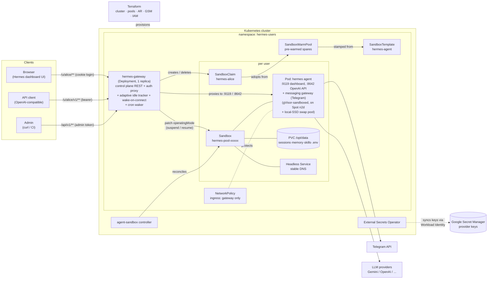
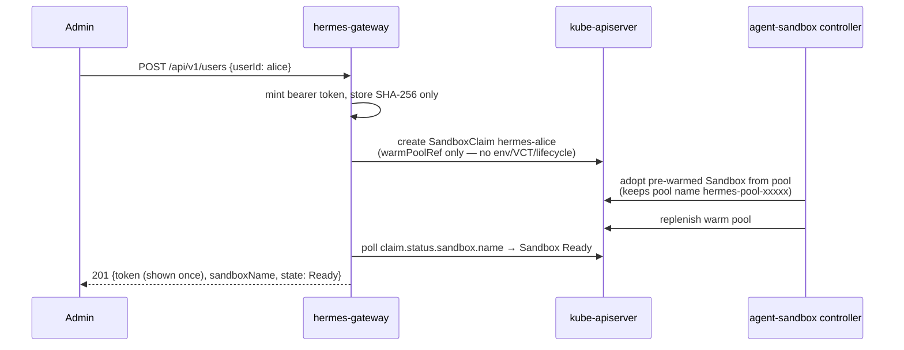

# Talaria — Hermes Agents as a Service

[](https://github.com/aditya-shantanu/ai-agent-service/actions/workflows/ci.yml)

*Named for Hermes' winged sandals: agents that sleep when idle and wake in
seconds.*

Multi-user **AI agent as a service** on Kubernetes: every user gets a personal
[Hermes Agent](https://github.com/NousResearch/hermes-agent) running in its own
[agent-sandbox](https://github.com/kubernetes-sigs/agent-sandbox) `Sandbox`,
provisioned in ~2 seconds from a warm pool and **suspended when idle** to save
cost — with state (conversations, memory, skills) surviving on a PVC and a
transparent wake-on-connect when the user returns.

Talaria is the platform; the `hermes-*` component names (chart
`hermes-service`, binaries `hermes-gateway`/`hermes-bench`) are named for the
tenant agent they serve. Why Hermes as the tenant: `docs/why-hermes.md`.

## Quickstart

| | **Local mode (kind)** | **Production mode (GKE)** |
|---|---|---|
| One command | `make dev` | `make deploy-gke GCP_PROJECT=<your-project>` |
| Cluster | kind `hermes-svc` (created for you) | GKE `hermes-svc` in your GCP project — **Terraform-managed** (`make infra-apply`) |
| Values | `values-kind.yaml` | `values-gke.yaml` |
| Idle suspend | adaptive: **15s** isolated / **2m** in-conversation | adaptive: **15s** / **10m** active window (UX posture; both are values knobs) |
| Warm pool | 2 spares | 5 spares |
| Images | built locally, `kind load`ed | pushed to Artifact Registry (`make images-push`) |
| Exposure | `kubectl port-forward` | LoadBalancer (put TLS/Ingress in front for real traffic) |
| NetworkPolicy | enforced (kube-network-policies) | enforced (Dataplane V2) |
| Sandbox nodes | kind node (runc) | **gVisor (GKE Sandbox) on Spot `n2d-standard-8` + local-SSD swap** (62 agents/node measured) |
| Provider keys | `.env` → cluster Secret (`make set-provider-key`) | `.env` → Secret Manager → ESO sync (keyless Workload Identity) |

```sh
# LOCAL: everything from zero to a working platform
make dev                    # kind cluster + agent-sandbox + helm install
make e2e                    # verify: 11-check suite

# LLM key (required for actual conversations; infra + e2e work without it):
cp .env.example .env        # fill in GEMINI_API_KEY (file is gitignored)
make set-provider-key       # loads .env into the cluster, cycles warm spares

# Interactive console (kind or GKE): create/list/suspend/resume/delete
# agents, chat, run e2e, deploy — menu-driven, loops until you quit:
hack/console.sh

# PRODUCTION: one command does everything (Terraform infra, images, ESO,
# Secret Manager key push, swap pool, helm) — see docs/gke.md
make deploy-gke GCP_PROJECT=<your-project>
```

Provider keys never live in git, values files, or shell history. Local mode
loads your gitignored `.env` straight into the cluster Secret; production
mode pushes `.env` to **Google Secret Manager** and syncs it via **External
Secrets Operator** over Workload Identity (keyless, IAM-audited, rotatable in
one place). Existing users pick a new key up on their next suspend/resume;
warm spares are cycled so new signups get it instantly.

Both modes end with the Helm NOTES walkthrough: grab the admin token, create
users, chat. API reference: `docs/api.md`.

## Architecture



**What the gateway is (and is not):** a single Go binary in an ordinary
Deployment — an *application-level* gateway, not a Kubernetes Gateway API /
Ingress implementation. Wake-on-connect, per-user token auth against claim
annotations, and idle tracking are custom control logic no standard edge proxy
can express. TLS/domain termination belongs in front of it (GKE LoadBalancer /
Ingress / Gateway API — see `docs/gke.md`).

## Key flows

### Provisioning (warm pool → ~2s to Ready)



### Idle suspend and wake-on-connect (the cost-saving loop)

```mermaid
sequenceDiagram
    participant User
    participant GW as hermes-gateway
    participant K8s as kube-apiserver
    participant Pod as hermes pod
    participant PVC

    Note over GW: idle sweep (30s tick), ADAPTIVE window:<br/>short tail after an isolated request,<br/>longer while a conversation is active<br/>(idle.timeout / idle.activeTimeout values).<br/>Skips: open connections, suspend-exempt, cron grace
    GW->>K8s: patch Sandbox operatingMode=Suspended
    K8s->>Pod: delete pod
    Note over PVC: PVC + headless Service retained.<br/>Sessions (SQLite), memory, .env all safe.

    User->>GW: GET /u/alice/v1/models (bearer token)
    GW->>GW: verify token vs claim annotation (constant-time)
    GW->>K8s: patch operatingMode=Running (per-user mutex)
    K8s->>Pod: recreate pod, reattach same PVC
    GW->>GW: hold request until Ready (≤ wakeTimeout;<br/>measured latencies: benchmarks/)
    GW->>Pod: proxy request (platform API key injected)
    Pod-->>User: response — history & login session intact
```

Telegram bots are injected at runtime (token → owned Secret → in-pod `.env`
rewrite → service restart, user marked suspend-exempt so the long-polling bot
stays up) — details and the full management API in `docs/api.md`.

## Testing & benchmarking

```sh
make test              # unit tests (fake clientsets, httptest) — seconds
make e2e               # full-loop platform test, 11 checks — ~10 min on kind
make simulate-users    # multi-user emulation (USERS=n) — ~5 min on kind
make bench             # UX latency benchmark vs an always-alive baseline
make bench-check       # same, gated by benchmarks/budgets-kind.yaml
```

**`make e2e`** drives one user through the entire lifecycle via the public
API only: provision → proxy auth negatives → dashboard login → OpenAI-
compatible call → idle suspension (pod deleted, PVC retained) → transparent
wake-on-connect → session survival → Telegram inject/remove → cron wake with
zero traffic → idempotent replay → cascade delete. Green on kind and GKE.

**`make bench`** (`benchmarks/`) prices the cost/UX trade with a repeatable
measurement: signup (warm and cold pool) and return-after-suspend latency,
compared against a suspend-exempt always-alive agent. Headline from the GKE
calibration run: baseline request p50 **172ms**, resume-after-suspend p50
**23.8s** under gVisor — a **+23.6s suspension UX tax** that future cost work
is budgeted against (`benchmarks/budgets-*.yaml`). kind: baseline ~20ms,
resume ~4s. Full validation history: `docs/validation-log.md`.

## The cost story

An always-on agent on this hardware costs ~$270/agent/month and is strictly
better UX (zero wake lag). The platform is a bet that ~1000× cheaper is worth
one cold-start pause per return-after-absence:

**$270 always-on → $12.88 (suspend-when-idle) → $1.59 (right-sized requests +
machine shape) → $0.75 (Spot) → $0.14 (LSSD swap density, at scale) → +$0.06
deliberately spent back on UX** (10-minute active window so most same-day
returns hit a swap-resident agent at sub-second wake instead of a cold
resume).

At scale the curve amortizes to **$2.23/agent at 100 agents, $0.30 at 1,000,
$0.16 at 10k, $0.14 from ~100k** — a million agents ≈ $144k/month vs ~$270M
always-on. For calibration: an LLM reply takes ~5–15s, so a sub-second wake
is invisible, while a 20-24s cold resume feels like one extra LLM turn of
dead air at the start of a session.

Every optimization, its measured price, and its mitigation:
`costcalc/COST-REDUCTION.md` (interactive model: open `costcalc/index.html`).

## Design decisions

All 25 load-bearing decisions (agent runtime, provisioning, control plane,
packaging, cost posture) live in **`docs/design-decisions.md`** — if you
change one, update that file.

## Future work

Designed and researched, deliberately not built yet:

- **Production data plane on Envoy** (`docs/envoy-dataplane-plan.md`):
  replace the single-replica Go proxy for 10k+ concurrent long-lived
  connections (proposal; includes the fact-checked GKE verdict).
- **Cron phase 2** — adopt Hermes' `CronScheduler` provider interface when
  it stabilizes upstream (`docs/cron-wake-design.md`, Phase 2 section).
- **Disk economics** — now the top cost lever (~60% of the at-scale floor):
  stage-in/stage-out storage (local SQLite + GCS cold store, floor → ~$0.075)
  — `investigations/resume-latency-and-storage.md`. Plus: swap pool into
  Terraform once the provider exposes `swapConfig`; TLS/domain in front of
  the gateway; webhook-mode Telegram; gateway scale-out.

## Development

```sh
make help                  # all targets
make build test lint       # Go dev loop
make kind-up deploy-kind   # local cluster + install
make e2e                   # full-loop test (11 checks)
```

Layout: `cmd/{gateway,hermes-bench}` ·
`internal/{config,server,api,auth,sandbox,proxy,idle,telegram,bench}` ·
`charts/hermes-service` (Helm) · `terraform/` (GCP infra) · `benchmarks/`
(UX latency budgets + runner) · `costcalc/` ($/agent model + cost roadmap) ·
`hack/` (kind bootstrap, e2e, simulation, GKE pools) · `docs/` (API, GKE,
design decisions, validation log, image contract, cron design, Envoy
proposal).

## Documentation

- `docs/api.md` — management + proxy API reference
- `docs/design-decisions.md` — the 25 numbered decisions
- `docs/gke.md` — production deployment and operations
- `docs/why-hermes.md` — choosing the tenant agent
- `docs/validation-log.md` — dated record of everything validated
- `docs/hermes-image.md` — the agent image contract
- `docs/cron-wake-design.md` — cron-aware wake design (implemented) + phase 2
- `docs/envoy-dataplane-plan.md` — data-plane scale-out proposal
- `benchmarks/README.md` — the UX benchmark and latency budgets
- `costcalc/COST-REDUCTION.md` — the cost model and optimization ledger

## License

Apache-2.0 — see `LICENSE`.
