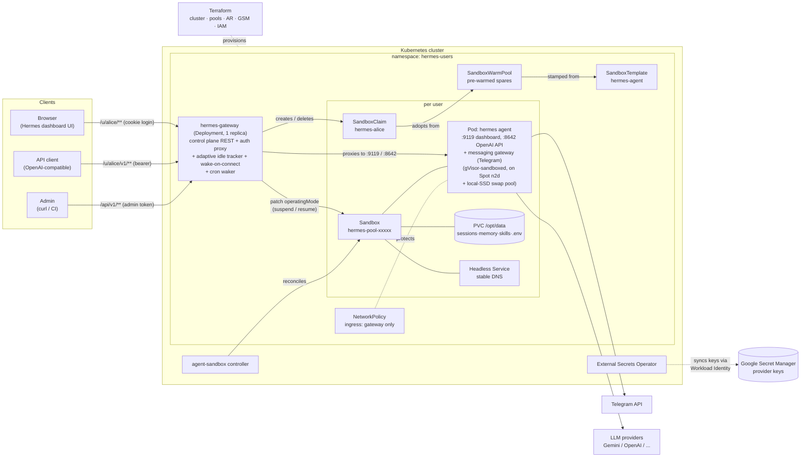
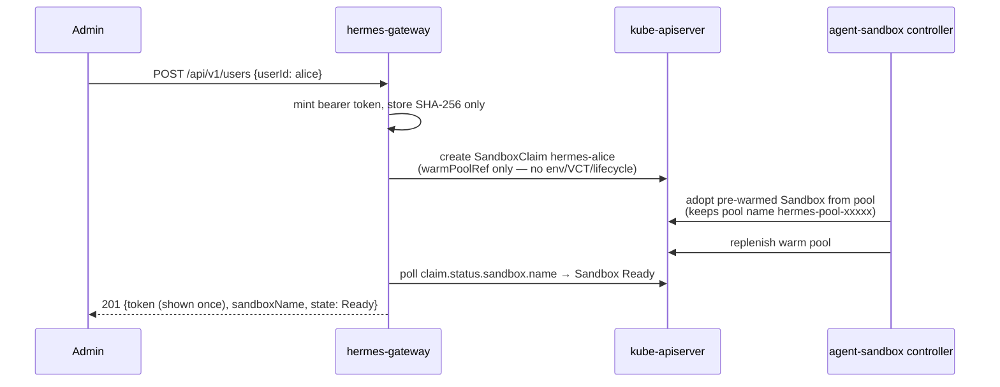
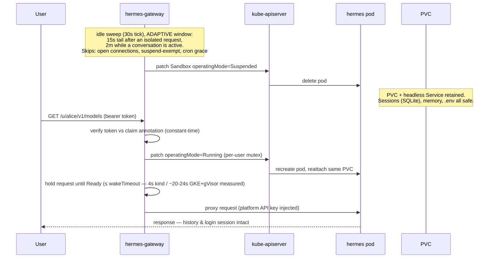
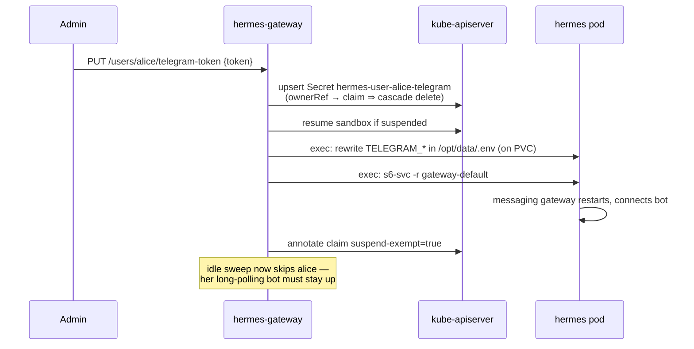

# Talaria — Hermes Agents as a Service

*Named for Hermes' winged sandals: agents that sleep when idle and wake in
seconds.*

Multi-user **AI agent as a service** on Kubernetes: every user gets a personal
[Hermes Agent](https://github.com/NousResearch/hermes-agent) running in its own
[agent-sandbox](https://github.com/kubernetes-sigs/agent-sandbox) `Sandbox`,
provisioned in ~2 seconds from a warm pool and **suspended when idle** to save
cost — with state (conversations, memory, skills) surviving on a PVC and a
transparent wake-on-connect when the user returns.

## Why Hermes (and not OpenClaw)?

Both are MIT-licensed, single-user personal agents with one long-lived
gateway process and all durable state under a single relocatable directory —
either *works* in a suspend/resume, per-user-pod platform. Hermes won on how
deliberately it handles being killed, which is this platform's whole premise:

1. **Restart tolerance is a designed-in feature.** Hermes flags in-flight
   sessions as `restart_interrupted`, auto-resumes them, and notifies the
   user; sessions live in SQLite committed per turn. Our suspend cycle (pod
   deleted → PVC reattached) is just a restart to Hermes. OpenClaw survives
   restarts via its state dir too, but documents no in-flight recovery.
2. **OpenClaw's rapid-restart "safe mode" is actively hostile to an automated
   suspend/resume loop**: after rapid unclean restarts it deliberately comes
   back with messaging channels suppressed — a few bad cycles and a user's
   channels silently stop reconnecting. Hermes has no such failure mode.
3. **Sleep-when-idle is an endorsed Hermes deployment pattern** (its docs
   recommend webhook mode for platforms that auto-wake suspended machines),
   and long-poll platforms like Telegram queue server-side while suspended,
   so messages catch up on resume. OpenClaw assumes 24/7 uptime — its cron
   and webhook channels silently miss events while down.
4. **The container contract is fully env-driven** (dashboard basic-auth +
   HMAC session secret, OpenAI-compatible API key, gateway bootstrap state —
   see `docs/hermes-image.md`), which is exactly what warm pools require:
   identical pods, personalized only by whose PVC and token map to them. As
   a bonus, dashboard sessions survive suspend/resume (validated), so users
   don't get logged out when their pod is recycled.
5. **Cron survives suspension — and upstream planned for external
   schedulers.** Hermes persists each job's `next_run_at` in
   `cron/jobs.json` (on the PVC) and catch-up-fires missed jobs once on
   boot (collapsed backlog, no burst), so a suspended sandbox turns
   "missed jobs" into "late jobs" by design. It also ships external-trigger
   hooks: `hermes cron tick` (fire due jobs once and exit) and an
   experimental pluggable `CronScheduler` provider aimed explicitly at
   scale-to-zero deployments — the platform can own *when* to wake while
   Hermes owns execution (see `docs/cron-wake-design.md`). OpenClaw's cron
   assumes 24/7 uptime: jobs silently miss while it's down.
6. **Multi-surface out of the box**: web dashboard + OpenAI-compatible API +
   20+ messaging platforms from one process, all state on one volume.

OpenClaw remains a fine self-hosted personal assistant; it's the wrong
*tenant* for a platform that kills pods on idle by design.

## Architecture



**What the gateway is (and is not):** a single Go binary in an ordinary
Deployment — an *application-level* gateway, not a Kubernetes Gateway API /
Ingress implementation. Wake-on-connect, per-user token auth against claim
annotations, and idle tracking are custom control logic no standard edge proxy
can express. TLS/domain termination belongs in front of it (GKE LoadBalancer /
Ingress / Gateway API — see `docs/gke.md`).

## Key flows

### Provisioning (warm pool → ~2s to Ready)



### Idle suspend and wake-on-connect (the cost-saving loop)



### Telegram bot token (runtime injection — warm-pool compatible)



## Two modes: local development vs production

| | **Local mode (kind)** | **Production mode (GKE)** |
|---|---|---|
| One command | `make dev` | `make deploy-gke` |
| Cluster | kind `hermes-svc` (created for you) | GKE `hermes-svc` in `gke-ai-eco-dev` — **Terraform-managed** (`make infra-apply`) |
| Values | `values-kind.yaml` | `values-gke.yaml` |
| Idle suspend | adaptive: **15s** isolated / **2m** in-conversation | same (deliberately short for test iteration; both are values knobs) |
| Warm pool | 2 spares | 5 spares |
| Images | built locally, `kind load`ed | pushed to Artifact Registry (`make images-push`) |
| Exposure | `kubectl port-forward` | LoadBalancer (put TLS/Ingress in front for real traffic) |
| NetworkPolicy | enforced (kube-network-policies) | enforced (Dataplane V2) |
| Sandbox nodes | kind node (runc) | **gVisor (GKE Sandbox) on Spot `n2d-standard-8` + local-SSD swap** (62 agents/node measured) |
| Provider keys | `.env` → cluster Secret (`make set-provider-key`) | `.env` → Secret Manager → ESO sync (keyless Workload Identity) |

```sh
# LOCAL: everything from zero to a working platform
make dev                    # kind cluster + agent-sandbox + helm install
make e2e                    # verify: 11-check suite

# LLM key (required for actual conversations; infra + e2e work without it):
cp .env.example .env        # fill in GEMINI_API_KEY (file is gitignored)
make set-provider-key       # loads .env into the cluster, cycles warm spares

# Interactive console (kind or GKE): create/list/suspend/resume/delete
# agents, chat, run e2e, deploy — menu-driven, loops until you quit:
hack/console.sh

# PRODUCTION: one command does everything (Terraform infra, images, ESO,
# Secret Manager key push, swap pool, helm) — see docs/gke.md
make deploy-gke
```

Provider keys never live in git, values files, or shell history. Local mode
loads your gitignored `.env` straight into the cluster Secret; production
mode (`make deploy-gke`) pushes `.env` to **Google Secret Manager** and syncs
it via **External Secrets Operator** over Workload Identity (keyless, IAM-
audited, rotatable in one place). Existing users pick a new key up on their
next suspend/resume; warm spares are cycled so new signups get it instantly.

Both modes end with the Helm NOTES walkthrough: grab the admin token, add a
real LLM provider key to `hermes-provider-keys`, create users, chat.
API reference: `docs/api.md`.

## Testing end-to-end

Three layers, fastest to slowest:

```sh
make test              # unit tests (fake clientsets, httptest) — seconds
make e2e               # full-loop platform test — ~10 min on kind
make simulate-users    # multi-user emulation — ~5 min on kind
make bench             # UX latency benchmark vs always-alive baseline — ~10 min
```

**`make e2e`** (`hack/e2e.sh`) drives one user through the entire lifecycle
via the public API only: provision (asserts warm adoption + speed) → proxy
auth negatives → dashboard login through the proxy → OpenAI-compatible call →
idle suspension (asserts pod deleted, PVC retained) → wake-on-connect (asserts
one request transparently resumes) → session survival across suspend/resume →
Telegram inject/remove → idempotent replay → cascade delete. It works against
either mode (`NS=hermes-users hack/e2e.sh`) unmodified — the idle phase
accounts for the adaptive window (request bursts count as conversations,
so suspension lands after the 2m active tail).

### Emulating multiple users

**`make simulate-users`** (`hack/simulate-users.sh`, `USERS=n` to scale) is
the multi-tenancy demo. It emulates n independent users from your terminal:

1. **Parallel signups** — n users created concurrently; you see which got a
   pre-warmed sandbox (~2s, `hermes-pool-*` from the pool) and, once the pool
   drains (kind keeps 2 spares), which took the cold path — plus the pool
   replenishing behind them.
2. **Concurrent traffic** — every user simultaneously calls their own agent
   through the proxy with their own token.
3. **Cross-user isolation** — user 1's token against user 2's agent: 401.
4. **Differential idling** — user 1 keeps a heartbeat going while the others
   go quiet; after the idle window only user 1 is still `Ready`, the rest are
   `Suspended` (pods gone, PVCs kept).
5. **Wake-on-connect** — user 2 sends one request and gets an answer after a
   ~4s (kind) / ~12s (GKE) hold, state back to `Ready`.

`KEEP=1` leaves the simulated users running so you can poke at them (e.g.
open two browser tabs on `/u/sim1/?token=…` and `/u/sim2/?token=…` — two
users, two dashboards, two isolated agents). Cleanup is otherwise automatic.

To emulate real *browser* users instead: create two users via the admin API,
open each dashboard URL in separate browser profiles, log in with the
platform dashboard credentials, and chat — each tab holds a WebSocket to its
own sandbox, which counts as activity and blocks idle suspension until the
tab closes.

### Benchmarking UX (the cost/experience trade)

**`make bench`** (`cmd/hermes-bench` via `benchmarks/run.sh`) turns the
scattered latency claims above into a repeatable measurement with a
contract. It times the two user-facing moments — signup (`POST
/api/v1/users`, warm and drained-pool cold) and coming back (wake-on-connect
against an explicitly suspended agent) — and compares them against an
**always-alive baseline** agent (suspend-exempt, the pre-cost-optimization
experience). The headline output is the **suspension UX tax** (resume p50 −
baseline p50): the seconds of user experience each dollar of cost
optimization spends. `make bench-check` additionally gates against the
per-environment budgets in `benchmarks/budgets-{kind,gke}.yaml` (exit 1 on
regression); `make bench-gke` runs the same suite against the GKE
LoadBalancer, where gVisor + PD attach dominate. `TTFT=1` adds streamed
chat time-to-first-token scenarios (spends LLM credits). Details, scenario
matrix and budget semantics: `benchmarks/README.md`.

## Status

| Milestone | State |
|---|---|
| M1 Hermes image contract validated | ✅ `docs/hermes-image.md`, `make validate-hermes-image` |
| M2 K8s dress rehearsal (kind) | ✅ `hack/m2-dress-rehearsal.sh` (7 checks) |
| M3 Control plane REST API | ✅ unit tests + live kind validation |
| M4 Proxy + wake + idle suspend | ✅ wake hold 4s on kind / ~12s on GKE (post probe-tuning) |
| M5 Telegram token injection | ✅ inject/remove + suspend exemption |
| M6 Helm chart + e2e | ✅ `make e2e` — 11 checks |
| M7 GKE (`gke-ai-eco-dev`) | ✅ cluster `hermes-svc` (us-central1-a, DPv2) — e2e green, NetworkPolicy enforced |
| M8 Cron-aware wake | ✅ e2e check #9 — scheduled job wakes a suspended sandbox, zero user traffic |
| Infra as Terraform + Secret Manager keys | ✅ from-zero rebuild validated; ESO/Workload Identity sync |
| M9 gVisor sandbox hardening (GKE Sandbox) | ✅ e2e 11/11 on `hermes-gvisor-pool`; swap density mechanism verified under gVisor; $/agent floor unchanged |
| Cost posture (Spot, shape, measured requests, adaptive suspension, **LSSD swap**) | ✅ \$12.88 → **\$0.14/agent at-scale floor** — `costcalc/COST-REDUCTION.md` |

## Validations performed

Everything below was executed against real clusters (kind and/or GKE), not
inferred. Automated suites are re-runnable via the listed entry points.

| Validation | Where | Evidence / entry point |
|---|---|---|
| Hermes image env contract (auth gates, session-secret survival, telegram `.env` injection, non-root, restart persistence) | Docker | `make validate-hermes-image` — 5 checks |
| agent-sandbox layer (warm adoption ≤2s, env-claims rejected, NetworkPolicy enforced, suspend retains PVC+Service, resume (now 4s post probe-tuning), exec injection) | kind | `hack/m2-dress-rehearsal.sh` — 7 checks |
| Full platform loop (provision → proxy auth + both surfaces → idle suspend → wake-on-connect → session survival → telegram → **cron wake with zero traffic** → idempotent replay → cascade delete) | kind + GKE | `make e2e` — 11 checks, green on both |
| Multi-user concurrency (parallel warm/cold signups, concurrent traffic, cross-user 401 isolation, differential idle-suspend, transparent wake) | kind | `make simulate-users` |
| NetworkPolicy is the isolation boundary (unlabeled pods blocked, gateway label admitted) | kind (kube-network-policies) + GKE (Dataplane V2) | in m2 script + manual GKE check |
| GKE production deploy (AR images, warm pool 72s to Ready, e2e 11/11, wake ~16-20s over PD reattach) | GKE `gke-ai-eco-dev` | `make deploy-gke` + `hack/e2e.sh` |
| **Swap density + mixed load (2026-07-17)**: 62 PVC-backed agents on one n2d-standard-8 Spot node (3.9×), 20% concurrently active → idle cohort 28ms avg, memory PSI 0.00; earlier no-PVC run: 198 agents/node, ~29GB paged to SSD, 117–195ms swapped responses | GKE swap pool | `hack/swap-experiment/` + `hack/gke-swap-pool.sh` |
| **gVisor (GKE Sandbox) migration (2026-07-17)**: e2e 11/11 on the gVisor pool (warm adoption 2s, wake 20–24s, cron wake, telegram exec-inject, cascade delete); s6 setuid bootstrap elevates (`euid=0`) under GKE's managed runsc; forced 24 GiB memory pressure → 5.1 GB of memfd sandbox memory paged to LSSD, all pods healthy, PSI ~0.3, idle-cohort 17–88ms; CPU benchmark parity, small-file I/O 1.6×, +15% pod memory | GKE `hermes-gvisor-pool` | `hack/gke-gvisor-pool.sh` + `hack/e2e.sh` + `make simulate-users` |
| **From-zero Terraform rebuild (2026-07-17)**: `terraform apply` (cluster/WI/AR/GSM/IAM) → full deploy chain → e2e 11/11 → real Gemini chat → memory recalled across suspend/kill/wake in 25s (key synced from Secret Manager via ESO/Workload Identity) | GKE, fresh cluster | `make deploy-gke` |

### Durability deep-dive (2026-07-17): does everything survive kill/recreate?

A dedicated two-cycle suspend/recreate test (`persist` user, explicit suspend
then two autonomous cron wakes, zero user traffic):

- **Agent survives**: all three s6 services healthy after each recreation;
  a dashboard login session created *before* the first kill was still valid
  after it (users are never logged out by suspension).
- **Cron jobs continue across recreations** — recurring `every 2m` job fired
  3× across two kill cycles: `18:12:33` (cron-wake #1), `18:17:39` (in-pod
  ticker while awake between cycles), `18:19:47` (cron-wake #2, after the
  second suspend re-captured `next_run_at`). The
  suspend→capture→wake→fire loop is self-sustaining. One-shot jobs wake
  exactly once, verified separately.
- **Skills / memory / filesystem changes survive byte-for-byte**: a planted
  custom skill, a `MEMORY.md` append, and a workspace file had identical
  md5 checksums after recreation. Everything under `/opt/data` (PVC) is
  durable; anything outside it dies with the pod, by design.

### Real-LLM validation (2026-07-17, Gemini via .env flow)

With a real `GEMINI_API_KEY` loaded via `make set-provider-key`:

- **Live chat through the full stack** (proxy → Hermes API server → Gemini).
- **Agent memory survives the kill**: the agent saved "MOONBEAM-77" to its
  persistent memory (verified on-PVC in `memories/MEMORY.md`), the pod was
  suspended and deleted, and a single chat request against the dead sandbox
  woke it and answered **MOONBEAM-77 in 15 seconds total** (wake + LLM).
- **Skills are actively LOADED, not just stored**: a hand-planted skill file
  was found and used by the recreated pod's agent (answered the probe
  codeword PLUM-PUDDING-42).
- Gap found and fixed during this validation: Hermes' seeded config defaults
  to an Anthropic model (404s on Gemini-only deployments) — the chart now
  pre-seeds `hermes.defaultModel` (default `google/gemini-flash-latest`) via
  an init container; a fresh user chats with zero manual setup.

## The cost/UX trade, honestly

Every optimization below bought cost at a price — usually latency. The
baseline truth: an **always-on agent is strictly better UX** (zero wake lag,
no preemption surprises) and costs ~$270/agent/month on this hardware. The
whole platform is a bet that the trade below is worth ~1000× cheaper agents.
For calibration: Hermes itself is not slow — an LLM reply takes ~5–15 s — so
a sub-second wake is invisible, while a 16–25 s cold resume feels like one
extra LLM turn of dead air at the start of a session.

| Optimization (in order applied) | Effect on $/agent/month | UX / other downside | Mitigation in place |
|---|---|---|---|
| **Suspend-when-idle** (the architecture) | 🟢 ↓ $270 → **$12.88** (21×) — big, but only the first step | **Cold wake: lag when returning after an absence** | Login sessions + memory survive, so lag is the *only* symptom; wake ≈ one LLM turn |
| **Warm pool** | ≈ neutral (~$3/mo spares) | ✅ none — signup drops to ~2 s (a UX *win*) | — |
| **Right-sized requests + balanced machine shape** | 🟢 ↓ → **$1.59** | Burst contention if many agents work at once (CPU throttling → slower replies at peak) | Limits keep 2 vCPU of burst headroom; mixed-load tested clean at 4× modeled peak |
| **Spot sandbox nodes** | 🟢 ↓ → **$0.75** | Rare, *unplanned* 16 s stall mid-session on preemption; an in-flight turn can be dropped | Hermes flags sessions `restart_interrupted` and auto-resumes; gateway/controllers stay on-demand |
| **Adaptive suspension** (15 s / 2 m windows) | ≈ neutral | ✅ conversations pay the cold wake once, not per message; returns after the window still hit it | `idle.activeTimeout` is a per-tier dial (see `investigations/`) |
| **LSSD swap + measured requests** (100m/256Mi) | 🟢 ↓ → **$0.14** at-scale floor (slot $5.57 → $1.50, 3.9× density) | Swapped-agent wake +100–400 ms (measured; invisible vs LLM); *theoretical* thrash if far more agents go active than modeled | Mixed-load tested clean at 20% concurrent; PSI alerting is the open TODO |
| **Cron-aware wake** | ≈ neutral — *protects* the savings (jobs no longer force always-on pods) | Jobs can fire up to ~1 min late; jobs longer than the 2 m grace risk interruption | Hermes boot catch-up fires missed jobs once; `cron.grace` is a knob; Telegram users are exempt entirely |
| **Startup tuning** (aggressive readiness probe + GKE image streaming, 2026-07-17) | 🟢 ↓ slightly (shorter resumes = less pod-time) | ✅ cold resume **16–25 s → ~11–14 s on GKE** (remaining chunk is PD attach — see `investigations/`) and **12 s → 4 s on kind**; more consistent | — |
| **Production active window 10 m** (GKE) | 🔴 ↑ ≈ **+$0.06** — accepted | ✅ most same-day returns land on a swapped-resident agent: **sub-second wake instead of cold resume** | Window is a per-tier values knob; swap pool makes residents cheap |
| **gVisor sandboxing** (GKE Sandbox, 2026-07-17) | ≈ neutral — no GCP charge, 62 slots/node unchanged (CPU-bound), swap still reclaims Sentry memfd memory (verified under 24 GiB forced pressure) | Cold resume **11–14 s → 20–24 s** (+Sentry boot & import gofer tax); +15% memory/agent eats *future* memory-bound squeeze headroom | Agents get kernel-syscall isolation on top of NetworkPolicy; resume roadmap (stage-in/out storage, boot tuning) attacks the same delta; see `costcalc/COST-REDUCTION.md` |

No single row gets to <$1: the journey is a waterfall —
**$270 always-on → $12.88 (suspend) → $1.59 (requests+shape) → $0.75 (Spot)
→ $0.14 (swap, at scale)** → **+$0.06 deliberately spent back on UX**
(10 m active window) — each step with its own row of fine print above.

**What the trade buys at scale**: $/agent falls as fixed costs amortize and
plateaus at the marginal floor — **$2.23 at 100 agents, $0.30 at 1,000,
$0.14 from ~10k onward** (a million agents ≈ $144k/month, vs ~$270M/month
if every agent ran always-on). The always-on comparison is the honest
denominator for every UX complaint in this table: the lag exists because
each agent pays only for its ~20 minutes of daily pod-time instead of all
1,440. Full curve and assumptions: `costcalc/` (open `index.html`).

Bottom line: the user-visible price of ~1000× cheaper agents is **one
cold-start pause per return-after-absence, and the occasional Spot hiccup**.
Both shrink with the roadmap (wider active windows now; stage-in/stage-out
storage later makes even cold wakes ~1–3 s).

## Design decisions & caveats

All 25 load-bearing decisions (agent runtime, provisioning, control plane,
packaging, cost posture) live in **`docs/design-decisions.md`** — if you
change one, update that file.

## Future work

Designed and researched, deliberately not built yet:

- **Production data plane on Envoy** (`docs/envoy-dataplane-plan.md`): replace
  the single-replica Go proxy with self-hosted Envoy (ext_authz headers-only
  auth + wake-hold, ORIGINAL_DST per-user routing) for 10k+ concurrent
  long-lived connections. Includes the fact-checked **GKE verdict**: works
  only as self-hosted Envoy behind an L4 passthrough NLB — GKE's managed
  Gateway is disqualified (Service Extensions timeout caps; no dynamic
  upstream steering). Four spikes remain before implementation.
- **Cron phase 2 — adopt Hermes' `CronScheduler` provider interface when it
  stabilizes** (today EXPERIMENTAL upstream: one consumer, and the hooks it
  needs — `on_jobs_changed`/`fire_due`/`reconcile` — are planned but not
  shipped). Proposed integration once ready:
  1. **Ship a provider plugin** (`plugins/cron_providers/k8s_platform/`)
     baked into our Hermes image config seed and selected via
     `cron.provider: k8s_platform` in the bootstrap `config.yaml`. Its
     `is_available()` checks for the platform env (`PLATFORM_CRON_ENDPOINT`
     injected by the SandboxTemplate); on any failure Hermes auto-falls back
     to the built-in 60s ticker, so worst case equals today's behavior.
  2. **Push, don't peek**: on `on_jobs_changed`, the provider POSTs the
     job list's earliest `next_run_at` to a small gateway endpoint
     (`PUT /api/v1/users/{id}/next-cron`, authenticated with the shared
     in-sandbox platform credential; the gateway maps pod identity → user
     via the `sandbox.users.io/hermes-user` pod label). The gateway writes
     the same `next-cron-wake` claim annotation used today — the waker loop
     is unchanged. This deletes the exec-read-at-suspend capture and its
     only staleness window (jobs edited between capture and suspend).
  3. **Fire via the interface**: the waker calls the provider's `fire_due`
     (through a gateway→pod call or exec) instead of `hermes cron tick`,
     letting Hermes own dedup/catch-up semantics natively; `reconcile` on
     boot replaces our reliance on implicit boot catch-up.
  4. **Migration is additive**: annotation names, waker loop, and grace
     window all stay; only the annotation's *writer* changes. Run both
     paths in parallel behind a `cron.pushProvider` values flag until the
     upstream interface is declared stable, then delete `cronpeek.go`.
- **Disk economics** — now the top cost lever (~60% of the at-scale floor).
  Investigated 2026-07-17 (`investigations/resume-latency-and-storage.md`):
  live-NFS Filestore REJECTED (SQLite/WAL hazard, 6–8× per-GiB); the
  endgame is stage-in/stage-out (local SQLite + GCS cold store, floor
  → ~\$0.075) with the `idle.activeTimeout` dial as the zero-code interim.
- Fold the swap pool into Terraform when the provider exposes `swapConfig`;
  delete the idle rollback `sandbox-pool` after a quiet week.
- TLS/domain in front of the gateway on GKE; webhook-mode Telegram
  (suspendable bot users); gateway scale-out (also gated on the Envoy
  plan). *(gVisor sandbox hardening: done 2026-07-17 — see Status M9.)*

## Development

```sh
make help                  # all targets
make build test lint       # Go dev loop
make kind-up deploy-kind   # local cluster + install
make e2e                   # full-loop test (11 checks)
```

Layout: `cmd/gateway` (binary) · `internal/{config,server,api,auth,sandbox,proxy,idle,telegram}`
· `charts/hermes-service` (Helm) · `terraform/` (GCP infra) ·
`costcalc/` ($/agent model + cost roadmap) · `deploy/dev` (raw manifests used
during bring-up; the chart supersedes them) · `hack/` (kind bootstrap, e2e,
simulation, swap pool + experiments) · `docs/` (image contract, API, GKE,
cron design, Envoy plan).
