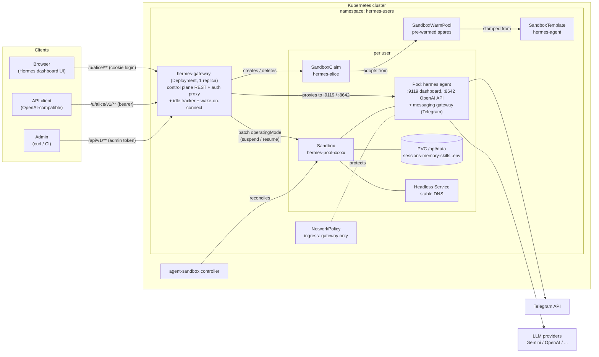
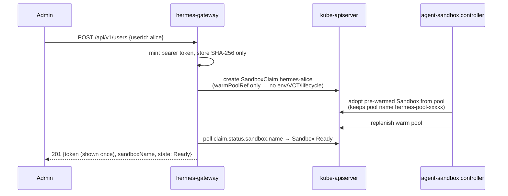
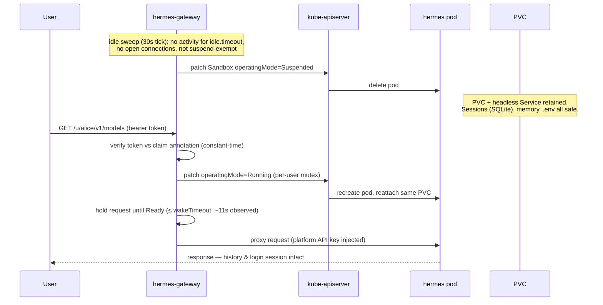
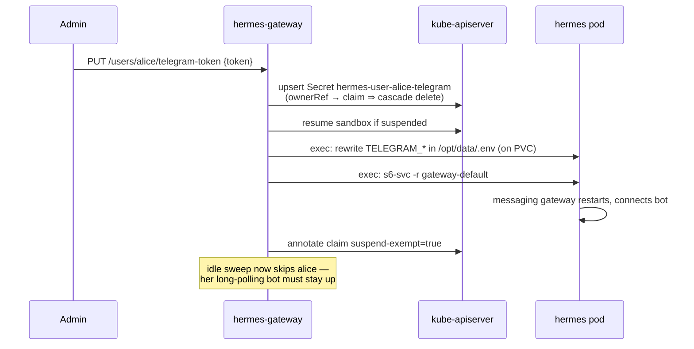

# ai-agent-service

Multi-user **AI agent as a service** on Kubernetes: every user gets a personal
[Hermes Agent](https://github.com/NousResearch/hermes-agent) running in its own
[agent-sandbox](https://github.com/kubernetes-sigs/agent-sandbox) `Sandbox`,
provisioned in ~2 seconds from a warm pool and **suspended when idle** to save
cost — with state (conversations, memory, skills) surviving on a PVC and a
transparent wake-on-connect when the user returns.

## Why Hermes (and not OpenClaw)?

Both are MIT-licensed, single-user personal agents with one long-lived
gateway process and all durable state under a single relocatable directory —
either *works* in a suspend/resume, per-user-pod platform. Hermes won on how
deliberately it handles being killed, which is this platform's whole premise:

1. **Restart tolerance is a designed-in feature.** Hermes flags in-flight
   sessions as `restart_interrupted`, auto-resumes them, and notifies the
   user; sessions live in SQLite committed per turn. Our suspend cycle (pod
   deleted → PVC reattached) is just a restart to Hermes. OpenClaw survives
   restarts via its state dir too, but documents no in-flight recovery.
2. **OpenClaw's rapid-restart "safe mode" is actively hostile to an automated
   suspend/resume loop**: after rapid unclean restarts it deliberately comes
   back with messaging channels suppressed — a few bad cycles and a user's
   channels silently stop reconnecting. Hermes has no such failure mode.
3. **Sleep-when-idle is an endorsed Hermes deployment pattern** (its docs
   recommend webhook mode for platforms that auto-wake suspended machines),
   and long-poll platforms like Telegram queue server-side while suspended,
   so messages catch up on resume. OpenClaw assumes 24/7 uptime — its cron
   and webhook channels silently miss events while down.
4. **The container contract is fully env-driven** (dashboard basic-auth +
   HMAC session secret, OpenAI-compatible API key, gateway bootstrap state —
   see `docs/hermes-image.md`), which is exactly what warm pools require:
   identical pods, personalized only by whose PVC and token map to them. As
   a bonus, dashboard sessions survive suspend/resume (validated), so users
   don't get logged out when their pod is recycled.
5. **Cron survives suspension — and upstream planned for external
   schedulers.** Hermes persists each job's `next_run_at` in
   `cron/jobs.json` (on the PVC) and catch-up-fires missed jobs once on
   boot (collapsed backlog, no burst), so a suspended sandbox turns
   "missed jobs" into "late jobs" by design. It also ships external-trigger
   hooks: `hermes cron tick` (fire due jobs once and exit) and an
   experimental pluggable `CronScheduler` provider aimed explicitly at
   scale-to-zero deployments — the platform can own *when* to wake while
   Hermes owns execution (see `docs/cron-wake-design.md`). OpenClaw's cron
   assumes 24/7 uptime: jobs silently miss while it's down.
6. **Multi-surface out of the box**: web dashboard + OpenAI-compatible API +
   20+ messaging platforms from one process, all state on one volume.

OpenClaw remains a fine self-hosted personal assistant; it's the wrong
*tenant* for a platform that kills pods on idle by design.

## Architecture



**What the gateway is (and is not):** a single Go binary in an ordinary
Deployment — an *application-level* gateway, not a Kubernetes Gateway API /
Ingress implementation. Wake-on-connect, per-user token auth against claim
annotations, and idle tracking are custom control logic no standard edge proxy
can express. TLS/domain termination belongs in front of it (GKE LoadBalancer /
Ingress / Gateway API — see `docs/gke.md`).

## Key flows

### Provisioning (warm pool → ~2s to Ready)



### Idle suspend and wake-on-connect (the cost-saving loop)



### Telegram bot token (runtime injection — warm-pool compatible)



## Two modes: local development vs production

| | **Local mode (kind)** | **Production mode (GKE)** |
|---|---|---|
| One command | `make dev` | `make deploy-gke` |
| Cluster | kind `hermes-svc` (created for you) | GKE `hermes-svc` in `gke-ai-eco-dev` (create once — `docs/gke.md`) |
| Values | `values-kind.yaml` | `values-gke.yaml` |
| Idle suspend | **1m** (default) | **1m** (default) — deliberately short for fast test iteration; raise `idle.timeout` for real users |
| Warm pool | 2 spares | 5 spares |
| Images | built locally, `kind load`ed | pushed to Artifact Registry (`make images-push`) |
| Exposure | `kubectl port-forward` | LoadBalancer (put TLS/Ingress in front for real traffic) |
| NetworkPolicy | enforced (kube-network-policies) | enforced (Dataplane V2) |

```sh
# LOCAL: everything from zero to a working platform
make dev                    # kind cluster + agent-sandbox + helm install
make e2e                    # verify: 10-check suite

# PRODUCTION: after the one-time GKE setup in docs/gke.md
make gke-credentials        # point kubectl at the GKE cluster
make deploy-gke             # push images + install/upgrade
```

Both modes end with the Helm NOTES walkthrough: grab the admin token, add a
real LLM provider key to `hermes-provider-keys`, create users, chat.
API reference: `docs/api.md`.

## Testing end-to-end

Three layers, fastest to slowest:

```sh
make test              # unit tests (fake clientsets, httptest) — seconds
make e2e               # full-loop platform test — ~4 min on kind
make simulate-users    # multi-user emulation — ~5 min on kind
```

**`make e2e`** (`hack/e2e.sh`) drives one user through the entire lifecycle
via the public API only: provision (asserts warm adoption + speed) → proxy
auth negatives → dashboard login through the proxy → OpenAI-compatible call →
idle suspension (asserts pod deleted, PVC retained) → wake-on-connect (asserts
one request transparently resumes) → session survival across suspend/resume →
Telegram inject/remove → idempotent replay → cascade delete. It works against
either mode (`NS=hermes-users hack/e2e.sh`), but the idle phase needs the
1m default timeout, so it runs unmodified against both kind and GKE.

### Emulating multiple users

**`make simulate-users`** (`hack/simulate-users.sh`, `USERS=n` to scale) is
the multi-tenancy demo. It emulates n independent users from your terminal:

1. **Parallel signups** — n users created concurrently; you see which got a
   pre-warmed sandbox (~2s, `hermes-pool-*` from the pool) and, once the pool
   drains (kind keeps 2 spares), which took the cold path — plus the pool
   replenishing behind them.
2. **Concurrent traffic** — every user simultaneously calls their own agent
   through the proxy with their own token.
3. **Cross-user isolation** — user 1's token against user 2's agent: 401.
4. **Differential idling** — user 1 keeps a heartbeat going while the others
   go quiet; after the idle window only user 1 is still `Ready`, the rest are
   `Suspended` (pods gone, PVCs kept).
5. **Wake-on-connect** — user 2 sends one request and gets an answer after a
   ~11–20s hold, state back to `Ready`.

`KEEP=1` leaves the simulated users running so you can poke at them (e.g.
open two browser tabs on `/u/sim1/?token=…` and `/u/sim2/?token=…` — two
users, two dashboards, two isolated agents). Cleanup is otherwise automatic.

To emulate real *browser* users instead: create two users via the admin API,
open each dashboard URL in separate browser profiles, log in with the
platform dashboard credentials, and chat — each tab holds a WebSocket to its
own sandbox, which counts as activity and blocks idle suspension until the
tab closes.

## Status

| Milestone | State |
|---|---|
| M1 Hermes image contract validated | ✅ `docs/hermes-image.md`, `make validate-hermes-image` |
| M2 K8s dress rehearsal (kind) | ✅ `hack/m2-dress-rehearsal.sh` (7 checks) |
| M3 Control plane REST API | ✅ unit tests + live kind validation |
| M4 Proxy + wake + idle suspend | ✅ wake hold ~11s observed on kind |
| M5 Telegram token injection | ✅ inject/remove + suspend exemption |
| M6 Helm chart + e2e | ✅ `make e2e` — 10/10 |
| M8 Cron-aware wake | ✅ e2e check #9 — scheduled job wakes a suspended sandbox, zero user traffic |
| M7 GKE (`gke-ai-eco-dev`) | ✅ cluster `hermes-svc` (us-central1-a, DPv2) — e2e 10/10, wake ~20s, NetworkPolicy enforced |

## Design decisions & caveats

Every load-bearing decision lives here. If you change one, update this list.

### Agent runtime

1. **Upstream Hermes image, unmodified, pinned** (`nousresearch/hermes-agent:v2026.7.7.2`).
   The upstream image already separates immutable code (`/opt/hermes`) from
   state (`HERMES_HOME=/opt/data` → our PVC), supervises the dashboard +
   messaging gateway via s6-overlay, and seeds config on first boot. A custom
   image bought us nothing. Full validated env contract: `docs/hermes-image.md`.
   *Caveat: image is amd64-only — Apple Silicon dev machines run it emulated
   (kind works via Rosetta binfmt); GKE amd64 default node pools are fine.*
2. **Two user surfaces per sandbox**: web dashboard (`:9119`, cookie-session
   auth via basic-auth login — the login form flows through our proxy
   untouched) and OpenAI-compatible API (`:8642`, per-request bearer; the
   proxy strips the user's platform token and injects the shared
   `API_SERVER_KEY` upstream). Both env-configured ⇒ warm-pool compatible.
3. **`HERMES_DASHBOARD_BASIC_AUTH_SECRET` must be set** (shared): dashboard
   session cookies are HMAC-signed with it. Without it every suspend/resume
   would log all users out. With it, sessions survive suspend/resume —
   verified by e2e check #7.
4. **Shared platform credentials inside sandboxes** (dashboard basic auth,
   `API_SERVER_KEY`, LLM provider keys are identical in every sandbox).
   Required for warm pools: pod env is baked before the user is known.
   *Caveat: the NetworkPolicy admitting only the gateway is therefore the
   real per-user isolation boundary — keep `networkPolicy.enabled: true`.
   Enforcement verified on kind (kube-network-policies) and expected on GKE
   Dataplane V2; verify on any other CNI before onboarding users.*
5. **The pod is the sandbox.** Hermes warns its terminal backend is
   "local/unsandboxed"; intentional here — an agent can only affect its own
   pod and PVC.

### Provisioning (agent-sandbox v0.5.2, pinned)

6. **SandboxClaim + SandboxWarmPool for fast first start.** Per-user claims
   keep `spec.env` and `spec.volumeClaimTemplates` empty — either would
   bypass the warm pool. Our template sets both injection policies to
   `Disallowed`, so such claims are **rejected outright**
   (`EnvVarsInjectionRejected`) instead of silently cold-starting. The only
   warm-compatible per-claim customization is `additionalPodMetadata`
   (pod labels must use the `sandbox.users.io` domain under default
   controller flags). Measured on kind: warm adoption ≤2s; resume ~11s.
7. **Never set claim `lifecycle`.** Every claim-expiry path deletes the
   Sandbox, which garbage-collects the user's PVC (their entire memory).
   User deletion = delete the claim (deliberate cascade: sandbox + PVC +
   claim-owned Secrets). Cost saving comes exclusively from
   `Sandbox.spec.operatingMode`, which no controller fights.
8. **Sandbox name ≠ claim name.** Warm-adopted sandboxes keep their
   pool-generated name. Always resolve
   `claim.status.sandbox.name → Sandbox → status.serviceFQDN`.
9. **Suspend deletes only the pod**; PVC and per-sandbox headless Service
   survive; resume reattaches the same PVCs. Pod-spec changes (e.g. a new
   provider-keys secret value) take effect on the next pod recreation —
   i.e. a suspend/resume cycle.

### Control plane

10. **No database.** The SandboxClaim *is* the user record; the per-user
    bearer token is stored only as a SHA-256 annotation on the claim
    (constant-time compare; raw token shown once at create/rotate); the
    Telegram token lives in a claim-owned Secret. `kubectl` is the admin UI
    of last resort.
11. **One Go binary, one replica.** Control plane + proxy + idle tracker
    share in-memory state (per-user wake mutexes, activity map). The
    Deployment uses `strategy: Recreate`. Scale-out path (sticky routing or
    moving last-activity to claim annotations + leader election) is a
    documented follow-up, not built.
12. **Custom application-level gateway instead of sandbox-router or a K8s
    Gateway/Ingress**: per-user authz, wake-on-request, and idle tracking are
    custom logic; a second hop buys nothing. Proxy techniques (dial-retry,
    `FlushInterval: -1`, Origin-strip on WebSocket upgrade) are borrowed from
    sandbox-router.
13. **Wake-on-connect holds the request** (up to `gateway.wakeTimeout`, 60s)
    rather than failing fast; observed resume is ~11s. Timeout → 503 +
    `Retry-After`. It is safe to flip `operatingMode` back to Running
    mid-suspension — never wait for `Suspended=True` first.
14. **Users with a Telegram token are exempt from idle suspend** by default
    (`idle.suspendTelegramUsers: false`): the bot long-polls from inside the
    sandbox and dies while suspended. Explicit `POST /suspend` still works.
    Webhook-mode Telegram through the gateway is the v2 fix.
15. **Telegram tokens are injected at runtime** (`pods/exec` → rewrite
    `$HERMES_HOME/.env` on the PVC → `s6-svc -r gateway-default`), because
    claim env is rejected by policy and template env is shared. The write
    lands on the PVC ⇒ survives suspend/resume without re-injection. Inputs
    are format-validated before touching a shell.
16. **Cron jobs wake suspended sandboxes** (`docs/cron-wake-design.md`):
    at suspend time the gateway reads the pod's `cron/jobs.json` (Hermes
    precomputes `next_run_at`) onto a claim annotation; a 30s waker loop
    resumes due sandboxes, execs `hermes cron tick`, and grants a 2m grace
    window the idle sweeper honors. One-shot jobs wake exactly once;
    recurring jobs re-capture at every suspend. Hermes' boot catch-up makes
    late wakes harmless (job fires once, no burst). Wake provenance is
    observable: `nextCronWake` + `lastWakeReason` (`connect|api|cron`) in
    the user status API.
17. **Gateway restart forgives idleness**: the in-memory activity map dies
    with the process, so after a gateway restart every user gets a fresh
    idle window (worst case: one extra `idle.timeout` of runtime). Suspended
    users stay suspended.

### Packaging

18. **agent-sandbox is a documented prerequisite**, installed from its pinned
    release manifest (`sandbox-with-extensions.yaml`, v0.5.2 — `make
    sandbox-install`) — not vendored as a subchart (upstream chart is
    unpublished and drift-prone). Go module pin matches: `sigs.k8s.io/agent-sandbox v0.5.2`.
19. **Helm chart** (`charts/hermes-service`) carries gateway, SandboxTemplate,
    WarmPool, RBAC and secrets. Platform secrets are **generated on first
    install and preserved across upgrades** (`lookup`-based); bring your own
    via `secrets.*.existingSecret`. `storageClassName: ""` = cluster default
    (works on kind and GKE). Provider keys go in one Secret injected via
    `envFrom` — add any `*_API_KEY` without touching the chart.
20. Images for GKE live in Artifact Registry in `gke-ai-eco-dev`
    (`make images-push` builds amd64 and mirrors the pinned Hermes image).

## Future work

Designed and researched, deliberately not built yet:

- **Production data plane on Envoy** (`docs/envoy-dataplane-plan.md`): replace
  the single-replica Go proxy with self-hosted Envoy (ext_authz headers-only
  auth + wake-hold, ORIGINAL_DST per-user routing) for 10k+ concurrent
  long-lived connections. Includes the fact-checked **GKE verdict**: works
  only as self-hosted Envoy behind an L4 passthrough NLB — GKE's managed
  Gateway is disqualified (Service Extensions timeout caps; no dynamic
  upstream steering). Four spikes remain before implementation.
- **Cron phase 2 — adopt Hermes' `CronScheduler` provider interface when it
  stabilizes** (today EXPERIMENTAL upstream: one consumer, and the hooks it
  needs — `on_jobs_changed`/`fire_due`/`reconcile` — are planned but not
  shipped). Proposed integration once ready:
  1. **Ship a provider plugin** (`plugins/cron_providers/k8s_platform/`)
     baked into our Hermes image config seed and selected via
     `cron.provider: k8s_platform` in the bootstrap `config.yaml`. Its
     `is_available()` checks for the platform env (`PLATFORM_CRON_ENDPOINT`
     injected by the SandboxTemplate); on any failure Hermes auto-falls back
     to the built-in 60s ticker, so worst case equals today's behavior.
  2. **Push, don't peek**: on `on_jobs_changed`, the provider POSTs the
     job list's earliest `next_run_at` to a small gateway endpoint
     (`PUT /api/v1/users/{id}/next-cron`, authenticated with the shared
     in-sandbox platform credential; the gateway maps pod identity → user
     via the `sandbox.users.io/hermes-user` pod label). The gateway writes
     the same `next-cron-wake` claim annotation used today — the waker loop
     is unchanged. This deletes the exec-read-at-suspend capture and its
     only staleness window (jobs edited between capture and suspend).
  3. **Fire via the interface**: the waker calls the provider's `fire_due`
     (through a gateway→pod call or exec) instead of `hermes cron tick`,
     letting Hermes own dedup/catch-up semantics natively; `reconcile` on
     boot replaces our reliance on implicit boot catch-up.
  4. **Migration is additive**: annotation names, waker loop, and grace
     window all stay; only the annotation's *writer* changes. Run both
     paths in parallel behind a `cron.pushProvider` values flag until the
     upstream interface is declared stable, then delete `cronpeek.go`.
- TLS/domain in front of the gateway on GKE; gVisor node pool for sandbox
  hardening; webhook-mode Telegram (suspendable bot users); gateway
  scale-out.

## Development

```sh
make help                  # all targets
make build test lint       # Go dev loop
make kind-up deploy-kind   # local cluster + install
make e2e                   # full-loop test (10 checks)
```

Layout: `cmd/gateway` (binary) · `internal/{config,server,api,auth,sandbox,proxy,idle,telegram}`
· `charts/hermes-service` (Helm) · `deploy/dev` (raw manifests used during
bring-up; the chart supersedes them) · `hack/` (scripts) · `docs/`.
