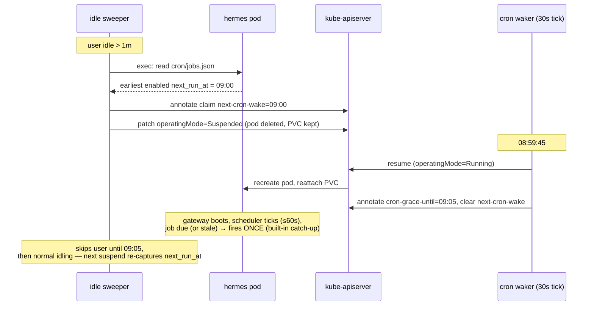

# Design: cron-aware wake (scheduled jobs vs suspended sandboxes)

**Status: implemented (Phase 1) — 2026-07-17.** Validated on kind: e2e check #9 proves a scheduled job resumes a suspended sandbox with zero user traffic. Problem: Hermes runs its cron scheduler inside the
sandbox (60s tick in the messaging-gateway process). A suspended sandbox has
no pod, so user-configured and internal cron jobs silently miss until the
user happens to reconnect. Suspend-exempting cron users (like Telegram users)
would forfeit all cost savings for anyone with a single daily job — not
acceptable.

**Upstream alignment (verified in source):** Hermes explicitly anticipates
external platforms owning the cron *trigger*. `cron/scheduler_provider.py`
defines a pluggable `CronScheduler` interface — its docstring names an
external "managed-cron provider for scale-to-zero deployments" as the
intended use, selected via the `cron.provider` config key — and
`hermes cron tick` runs all due jobs once and exits (external-trigger CLI).
The interface is EXPERIMENTAL today (one consumer; richer hooks
`on_jobs_changed`/`fire_due`/`reconcile` planned but not shipped), which
drives the phasing below: Phase 1 uses only stable surfaces (jobs.json +
boot catch-up + `cron tick`); Phase 2 adopts the provider interface once
upstream stabilizes it.

## The fact that makes this easy (verified in Hermes source)

`cron/jobs.py` persists `next_run_at` per job in `$HERMES_HOME/cron/jobs.json`
(**on the PVC — survives suspension**), and `get_due_jobs()` implements
catch-up: when the scheduler was down past a job's time, accumulated missed
runs are collapsed (no burst) **but the job still fires once on restart**
(grace = half the schedule period, clamped 120s–2h; beyond that it
fast-forwards yet still fires once). Consequence: the platform's wake timing
can be approximate. We wake near `next_run_at`; Hermes' own boot logic
guarantees the job fires.

## Design

Two small additions to the gateway (later: to the control plane of the Envoy
v2 architecture — nothing here touches the data path):

1. **Capture on suspend.** Both suspend paths (idle sweeper and explicit
   `POST /suspend`) already have a running pod in hand. Before patching
   `operatingMode: Suspended`, exec into the pod (`pods/exec`, same RBAC as
   Telegram injection): read `/opt/data/cron/jobs.json`, take the earliest
   `next_run_at` among enabled jobs, and store it as a claim annotation
   `hermes.ai-agent-service.dev/next-cron-wake`. No enabled jobs → remove the
   annotation. Read failure → log, suspend anyway (the job still catch-up
   fires on the next wake, whenever that is; documented trade-off).

2. **Cron waker loop.** A second background loop (30s tick, alongside the
   idle sweeper): list claims with `next-cron-wake <= now + 30s` whose state
   is `Suspended`/`Suspending` → `Resume()` → clear `next-cron-wake` → stamp
   `hermes.ai-agent-service.dev/cron-grace-until = now + cronGrace`
   (default **2m**, configurable `cron.grace`) → exec `hermes cron tick`
   in the fresh pod for immediate, deterministic firing (the built-in 60s
   ticker + boot catch-up remain the safety net if the exec fails).

3. **Sweeper protection.** The idle sweeper skips any user whose
   `cron-grace-until` is in the future — otherwise the 1m idle timeout would
   kill the pod before the 60s scheduler tick even runs the job. After the
   grace window, normal idling applies; the next suspend re-captures the new
   `next_run_at`.

## Edge cases and answers

| Case | Behavior |
|---|---|
| User adds/edits a job while running | Irrelevant until suspend; capture happens at suspend time, always fresh. |
| User adds a job while suspended | Impossible — any interaction (proxy/API) wakes the pod first. |
| Job runs longer than the grace window | v1 limitation: sweeper may suspend mid-run; Hermes flags the session `restart_interrupted` and resumes it on next wake. Mitigation: raise `cron.grace` (default 2m). v2: probe in-pod activity (e.g. running agent session) before suspending. |
| Waker misses the time (gateway restart/downtime) | Harmless — on the next wake from ANY cause, Hermes catch-up fires the job once. The annotation persists, so the waker fires late rather than never. |
| Telegram users | Already suspend-exempt; their in-pod cron just runs. This design only matters for suspendable users. |
| One-shot jobs (`run_at`) | Same jobs.json shape; earliest-time logic covers them (ONESHOT_GRACE in Hermes tolerates modest lateness). |
| Many users, same cron time (herd) | Waker resumes are staggered by the 30s tick granularity and warm resume is ~11–20s; acceptable at current scale. At 10k users, batch/stagger the waker (v2, and see the Envoy plan's mass-wake spike S4). |

## Phase 2 (when upstream stabilizes `CronScheduler`)

Ship a `plugins/cron_providers/` provider for Hermes (selected via
`cron.provider` in the seeded config) that pushes schedule changes to the
platform in real time: on `on_jobs_changed`, it calls a small gateway
endpoint (`PUT /api/v1/users/{id}/next-cron`, authenticated with the
sandbox's platform credential) to update the claim annotation the moment a
user adds/edits/removes a job — eliminating the exec-read at suspend time
and any staleness. The platform waker then calls `fire_due` (or keeps using
`cron tick`). This is the upstream-blessed end state; we don't build it
while the interface can change without deprecation.

## Cost model

A user with one daily job costs ~`grace + idle timeout` of runtime per day
(~3 min with defaults) instead of 24h always-on: the cost saving survives.

## Implementation checklist (when approved)

- `internal/sandbox/cronpeek.go`: exec + parse jobs.json → earliest
  `next_run_at` (reuse the Telegram `ExecRunner` interface + fake for tests).
- Suspend paths (`Lifecycle.Suspend`, idle sweeper) capture + annotate.
- `internal/idle/cronwaker.go`: waker loop; sweeper honors `cron-grace-until`.
- Config/chart: `cron.grace` (default 5m), waker interval.
- Unit tests: capture logic (fake exec), waker due/not-due matrix,
  sweeper-grace interaction, jobs.json parse edge cases (disabled jobs,
  no jobs, malformed).
- e2e check #11: create user → exec `hermes cron add` (a 2-minute interval
  marker job writing to `/opt/data/cron-marker`) → let idle suspend → assert
  waker resumes and the marker appears without any user traffic → assert
  re-suspension afterwards.
