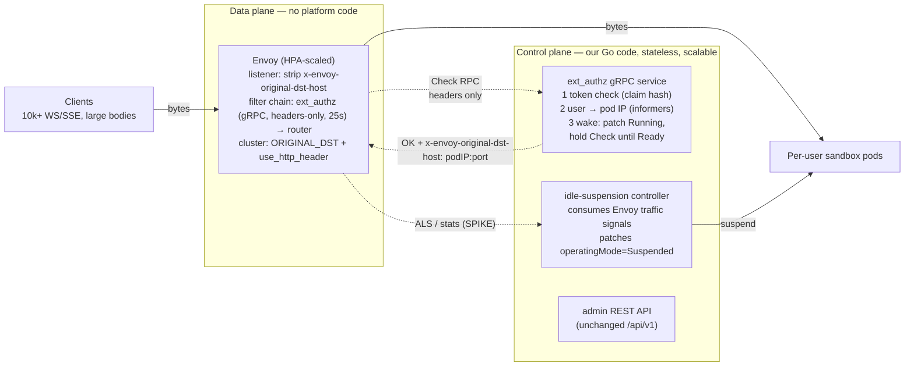

# Plan: production data plane on Envoy (v2 architecture)

**Status: proposed** (deep-researched 2026-07-16; findings adversarially
verified against primary sources — Envoy docs/PRs, Knative/KEDA source and
design docs). Motivation: the v1 gateway is a single-replica Go proxy that
terminates every user connection. It *streams* bodies (no buffering), but at
10,000s of concurrent, long-lived connections a custom Go proxy in the hot
path is the wrong tool: per-connection memory + GC in our code, no horizontal
scale (in-memory idle/wake state), and we maintain WebSocket/H2/retry
semantics ourselves. KEDA's own maintainers reached the same conclusion about
their http-add-on interceptor and proposed replacing it with Envoy
(keda http-add-on issue #1443).

## Verified building blocks (high confidence)

1. **`ext_authz` authorizes on headers only, by default.** The request body
   is never buffered or sent to the authz server unless `with_request_body`
   is explicitly configured. Arbitrarily large bodies flow through Envoy
   untouched while the decision is made. (Envoy docs; opt-in body added in
   PR #5824.)
2. **The authz hold is a config knob, not a hack.** Default check timeout is
   200ms, no documented upper bound, and the docs explicitly endorse raising
   it for slow decisions. A 10–25s wake-on-connect hold inside the Check RPC
   is supported — but route-level request timeout (default 15s) and idle
   timeouts must be raised in tandem.
3. **The authz response can inject upstream headers** (native header
   mutations in gRPC mode) — including `x-envoy-original-dst-host`.
4. **`ORIGINAL_DST` cluster + `use_http_header` gives per-request dynamic
   upstreams with zero per-user config.** Stable since 2018 (PR #3557).
   Idle hosts GC'd every `cleanup_interval` (5s default).
   Two hard rules: the header must be a **resolved `IP:port`** (DNS names
   fail *silently* — counter only), and the client's copy of the header
   **must be stripped at the listener** (unsanitized by default;
   security-critical).
5. **Prior art validates hold-until-ready:** Knative activator
   (buffer → probe readiness → forward, then exits the data path when warm),
   KEDA http-add-on interceptor (same pattern as our v1 Go proxy), and
   Netflix's ODCDS (pause request while discovering a cluster on demand).
   None fit our CRD-based backend directly — but the pattern is proven.

## Target architecture

Byte flow: client → Envoy → user pod. Our code sees **headers only**, ever.

What survives from v1 (becomes control plane): `internal/auth`,
`internal/sandbox` (resolve/lifecycle/provision — resolution switches from
FQDN to pod IP via informers), wake orchestration, idle sweep logic,
`internal/api`, `internal/telegram`. What gets deleted: `internal/proxy`
entirely (ReverseProxy, WS relay, retry transport — Envoy's job now).

## GKE verdict (deep-researched 2026-07-17; GCP facts versioned as-of that date)

**Verdict A: the design works on GKE — but only as self-hosted Envoy.**
GKE's *managed* Gateway (GCLB + Service Extensions) is categorically unable
to host it, on two independently fatal, verified facts:

1. **Callout timeout hard caps.** Service Extensions per-message timeouts:
   10–1,000 ms on Cloud LB traffic/route extensions, 10–10,000 ms on the GKE
   `GCPTrafficExtension`/`GCPRoutingExtension` CRDs; exceeding them → HTTP
   500 (fail-closed) or bypass (fail-open). A 10–25s wake-hold is
   unreachable — an order of magnitude over the ceiling.
2. **No ORIGINAL_DST equivalent.** Authorization extensions "can't influence
   backend service selection"; traffic extensions can't mutate
   `:authority`/host and the LB never re-evaluates routes after them; route
   extensions only choose among *pre-registered* backend services. Arbitrary
   per-request pod-IP steering does not exist in the managed data plane.
   (Lone partial exception: "dynamic forwarding", Preview 2025-12-08,
   regional-only, unverified for pod IPs — not a foundation.)

Also foreclosed: GKE's managed Cilium — custom eBPF is unsupported on DPv2
and the GKE Warden webhook actively rejects L7 rules in Cilium policies.

**The self-hosted path is confirmed viable at the networking layer:**

- VPC-native GKE pod IPs are natively VPC-routable → an Envoy pod dials any
  sandbox pod IP directly, no Service/NodePort — exactly what ORIGINAL_DST
  needs.
- Dataplane V2 enforces NetworkPolicy by pod identity/labels → our sandbox
  policy simply admits Envoy's pod labels (one-line change from admitting
  the gateway's labels today).

**Recommended GKE stack:** plain self-managed Envoy Deployment (static
bootstrap: one listener that strips client `x-envoy-original-dst-host`,
ext_authz gRPC filter with ~25s check timeout, single ORIGINAL_DST cluster
with `use_http_header`, ALS gRPC access logging) exposed via **L4 passthrough
Network LB** (Service type=LoadBalancer) with **TLS terminated at Envoy** —
sidestepping GCLB's backend-service timeout semantics for long-lived
WebSockets entirely. Envoy Gateway (the CNCF project) remains a *candidate*
packaging, but none of its claims survived verification (see spikes) — the
static-bootstrap Deployment is the safe default for a single-listener,
single-cluster config.

Honest limits of the research: the two managed-path blockers partly rest on
absence-of-documentation reasoning (strong for a closed managed platform,
not a logical proof); GCP launch stages are moving (ext_authz-type
authorization extensions GA'd 2026-06-17 for regional ALBs only); and Q3/Q5
(Envoy Gateway specifics, WS memory/drain at 10k–50k) still have no verified
claims — unchanged as spikes below.

## Unverified — must spike before committing (research found no reliable claims)

- **S1 — Idle signal:** Envoy gRPC ALS per-connection lifecycle (incl.
  WebSocket close events) vs polling per-cluster active-connection stats.
  Which is reliable at 10k conns, and what happens to close events across
  Envoy replica restarts? This is the linchpin of idle suspension.
- **S2 — Packaging (narrowed by the GKE verdict):** managed GKE Gateway is
  ruled OUT (see GKE verdict); the remaining question is Envoy Gateway CRDs
  vs raw static-bootstrap Envoy. Default to raw static bootstrap unless the
  spike shows Envoy Gateway can express the exact filter/cluster config
  without fighting its abstractions.
- **S3 — Scale numbers:** measured Envoy memory per idle WS connection,
  replica count for 10k–50k connections, drain behavior on upgrades.
- **S4 — Mass-wake thundering herd:** thousands of simultaneous 10–25s
  Check holds after an outage. Fallback design if fragile: KEDA-proposal
  pattern — Envoy cluster priorities, where priority-0 is the pod and
  priority-1 is a small Go "waker" service that only ever handles requests
  for suspended sandboxes (bounded load), instead of holding inside authz.

## Migration plan

| Phase | Work | Exit criterion |
|---|---|---|
| 0 | Spikes S1–S4 on kind (raw Envoy static bootstrap + toy authz server) | signals + packaging + hold-at-scale decided |
| 1 | `internal/authz`: gRPC ext_authz server wrapping existing auth+resolve+wake; pod-IP informers | unit tests + Envoy-in-docker integration test |
| 2 | Envoy deployment (chart): listener sanitization, filter chain, ORIGINAL_DST cluster, timeouts | e2e passes with bytes through Envoy, Go proxy still deployed but idle |
| 3 | Idle controller consumes chosen signal (S1); delete `internal/proxy`; gateway Deployment becomes control-plane-only (scalable >1 replica) | full e2e + simulate-users at N=50 on kind |
| 4 | GKE: Envoy behind LB (TLS at ingress), load test 10k WS connections, mass-wake drill | numbers documented in this file |

## Risks

- ext_authz behavior under thousands of concurrent long holds is
  undocumented (watermark flow-control is per-connection; herd behavior
  unknown) → S4 is mandatory, fallback designed.
- ORIGINAL_DST silently ignores bad host values → alert on
  `original_dst_host_invalid` counter from day one.
- Wake now happens under an Envoy-enforced deadline chain (authz timeout,
  route timeout) — resume >25s (image pull on a cold node) must degrade to a
  clean 503+Retry-After, not a hung connection.
- v1's per-user wake mutex lived in one process; the authz service is
  stateless/replicated, so wake dedup moves to the API server (patch is
  idempotent; concurrent WaitReady polls are cheap) — no leader needed for
  wake, only for the idle controller.
